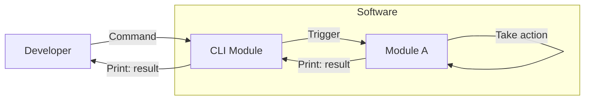
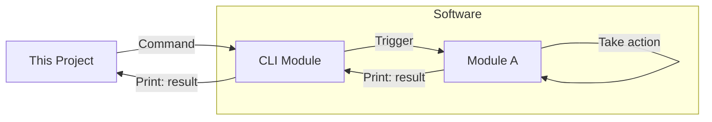

# blabot

## Overview

If development is proceeding in an environment configured as follows



Our project can automatically control and check inputs and outputs instead of developer.



## Environment

`poetry` environment is recommended.

```shell
cd ${BLABOT}

# If venv environment is necessary
sudo apt update
sudo apt install -y python3 python3-venv python3-pip
python3 -m venv venv
source venv/bin/activate

pip install poetry
poetry install

# Enter virtual environment
poetry shell
```

## Use in other projects

There are several ways to use this package in other projects, but here are two examples.

### Download from GitHub

```shell
pip install git+https://github.com/nunoya-yuma/blabot.git@main
```

### Build from local source code

```shell
cd ${BLABOT}
poetry build
pip install dist/blabot-0.0.1-py3-none-any.whl
```

## Examples

[Examples](./examples/README.md) are prepared. Please see it if necessary.

An overview description of each class is also available there, so I recommend taking a look at it.

## CI

Currently, GitHub Actions is executed at the time the PR is created.
In this flow, the format is checked and pytest is performed.

If you want to run GitHub Actions in your local environment, you can use [act command](https://github.com/nektos/act)

```shell
# e.g.)
act -j flake8_and_pytest
```
