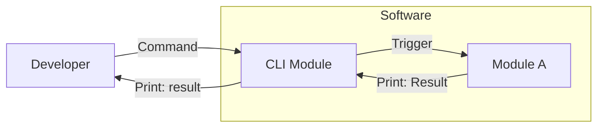
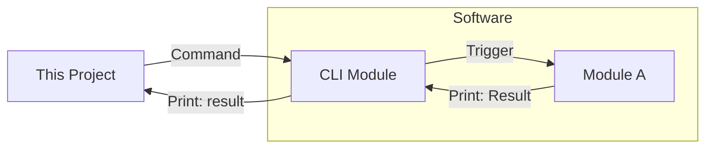

# nn-io-interact

## Overview

If development is proceeding in an environment configured as follows



Our project can automatically control and check inputs and outputs instead of developer.



## Environment

```shell
python3 -m venv venv
source venv/bin/activate
pip install -r requirements.txt
```

## Examples

[Examples](./examples/README.md) are prepared. Please see it if necessary.
