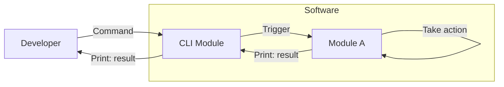
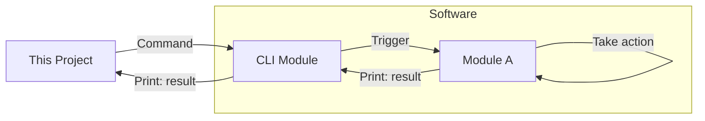

# blabot

## Overview

If development is proceeding in an environment configured as follows


```mermaid
graph LR
    Developer[Developer]

    subgraph Software[Software]
        CLI_Module[CLI Module]
        Module_A[Module A]
    end

    Developer -->|Command| CLI_Module
    CLI_Module -->|Print: result| Developer

    CLI_Module -->|Trigger| Module_A
    Module_A -->|Take action| Module_A
    Module_A -->|Print: result| CLI_Module
```

Our project can automatically control and check inputs and outputs instead of developer.


```mermaid
graph LR
    This_Project[This Project]

    subgraph Software[Software]
        CLI_Module[CLI Module]
        Module_A[Module A]
    end

    This_Project -->|Command| CLI_Module
    CLI_Module -->|Print: result| This_Project

    CLI_Module -->|Trigger| Module_A
    Module_A -->|Take action| Module_A
    Module_A -->|Print: result| CLI_Module
```

## Environment

`uv` environment is recommended.

```shell
cd ${BLABOT}

# Install uv if not already installed
curl -LsSf https://astral.sh/uv/install.sh | sh

# Install dependencies and set up development environment
uv sync
```

## Use in other projects

There are several ways to use this package in other projects, but here are two examples.

### Download from GitHub

```shell
pip install git+https://github.com/nunoya-yuma/blabot.git@main
```

### Build from local source code

```shell
cd ${BLABOT}
uv build
pip install dist/blabot-*-py3-none-any.whl
```

## Examples

[Examples](./examples/README.md) are prepared. Please see it if necessary.

An overview description of each class is also available there, so I recommend taking a look at it.

## Architecture

blabot follows a template method pattern: `TemplatedIO` (`blabot/templated_io.py`) defines the
common interface for sending commands and checking outputs, implemented by:

- **ProcessIO** (`blabot/process_io.py`) - local process communication
- **DeviceIO** (`blabot/device_io.py`) - serial device communication
- **SSHProcessIO** (`blabot/ssh_io.py`) - remote process communication via SSH
- **DockerRunIO** / **DockerExecIO** (`blabot/docker_io.py`) - container process communication

See [examples/README.md](./examples/README.md) for a walkthrough of each.

## Development

### Testing

This project uses `pytest` with markers to separate test categories.

```shell
# Run all tests
uv run pytest -v -s

# Run specific test categories
uv run pytest -v -s -m "simple_process_test and easy" tests/
uv run pytest -v -s -m "simple_process_test and hard" tests/
uv run pytest -v -s -m "device_test" tests/
uv run pytest -v -s -m "docker_test" tests/
uv run pytest -v -s -m "ssh_test" tests/
```

Device tests need `socat` to simulate a virtual serial device, and SSH tests need
`REMOTE_USER_NAME` / `REMOTE_HOST_NAME` / `REMOTE_KEY_PATH` environment variables pointing at a
reachable host. See [examples/README.md](./examples/README.md) for the full setup steps.

Docker-based testing:

```shell
docker compose build
docker compose run --rm example-app pytest -v -s -m docker_inner_test tests/
```

### Code Quality

```shell
# Lint and format with ruff
uv run ruff check .
uv run ruff format .

# Type checking with mypy
uv run mypy blabot/

# Lint YAML files (config: .yamllint.yaml)
uv run yamllint .

# Lint GitHub Actions workflows (no local install; runs in an ephemeral container)
docker run --rm -v "$PWD":/repo -w /repo rhysd/actionlint:latest -color
```

### Pre-commit Hooks (optional, local only)

```shell
# One-time setup: installs both pre-commit and pre-push git hooks
uv run pre-commit install

# Run manually against all files
uv run pre-commit run --all-files              # pre-commit stage (ruff format)
uv run pre-commit run --all-files --hook-stage pre-push  # pre-push stage (ruff check, mypy, yamllint)
```

`ruff format` runs on every commit; `ruff check`, `mypy`, and `yamllint` run on push, so frequent
small commits stay fast. This is a local convenience layer only — CI (`ci-tests.yaml`) is still the
source of truth and runs independently of whether hooks are installed. `actionlint` is intentionally
not part of pre-commit; it stays as a CI-only step (`reviewdog/action-actionlint`) for inline PR
annotations.

## CI

GitHub Actions runs the `lint_typecheck_and_test` job on every PR. It lints GitHub Actions workflows
with `actionlint`, lints YAML with `yamllint`, checks formatting and lints with `ruff`, type-checks
with `mypy`, and then runs the unit, example, SSH, Docker, and serial device test suites.

If you want to run GitHub Actions in your local environment, you can use [act command](https://github.com/nektos/act)

```shell
# e.g.)
act -j lint_typecheck_and_test
```
