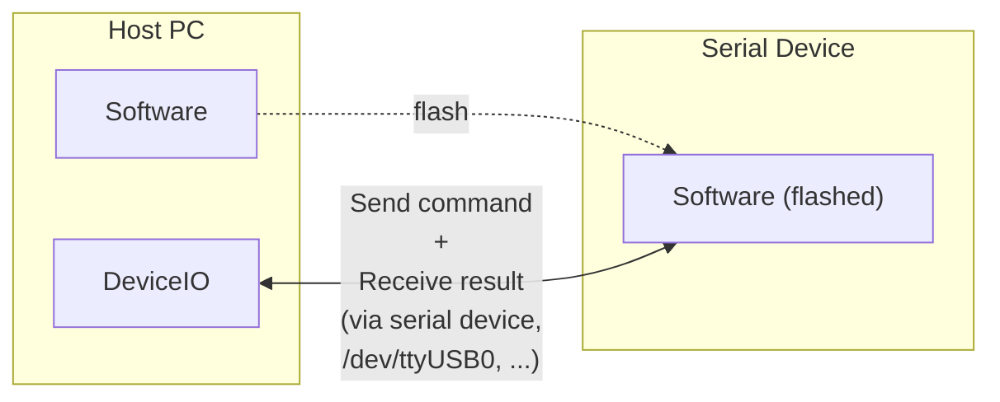
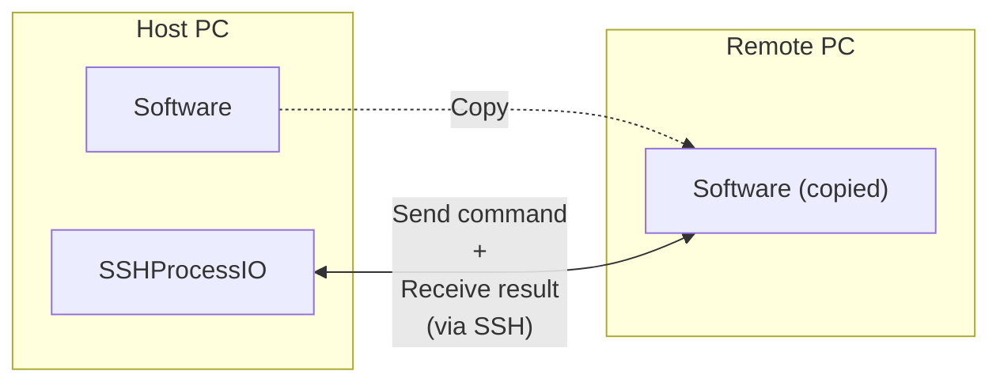
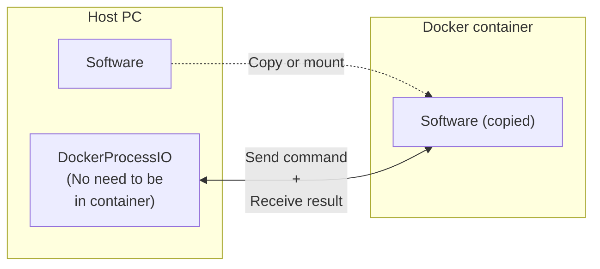
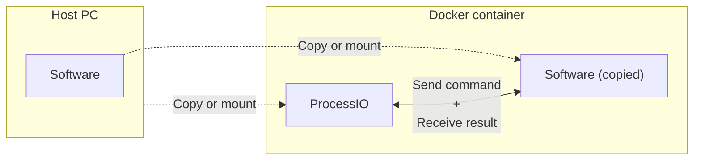

# Example

Examples are provided in this directory to demonstrate the use of classes.

`example.py` is a virtual development target software with simple CLI and used to explain the use of the classes.

It is recommended that it be used alone once.

```shell
cd ${NN_IO_INTERACT}/examples/
./example.py

# sample commands
> sample-status
> sample-ctrl on
> sample-ctrl off
```

This sample directory shows an example where a symbolic link refers to this project itself and is used as a submodule.

An example is provided in combination with pytest.

```shell
cd ${NN_IO_INTERACT}/examples/

# Run all tests
# Some preliminary preparation is required, but if the following steps have been properly configured,
# the test can be run with the following command.
pytest -v -s tests/
```

## ProcessIO

A class named `ProcessIO` is provided in the file `process_io.py`.

This class is a basic class that launches the process you want to run, sends commands to it, and analyzes the logs.

```shell
cd ${NN_IO_INTERACT}/examples/

# Run partial tests
pytest -v -s -m "simple_process_test and easy" tests/
pytest -v -s -m "simple_process_test and hard" tests/
```

## DeviceIO



A class named `DeviceIO` is provided in the file `device_io.py`.

This class is to communicate with serial device such as /dev/ttyUSB0.

By following the steps below, you can try it virtually with socat.

And the following procedure is the same as executing the `${NN_IO_INTERACT}/examples/scripts/run_device_test.sh` file, so you may execute that one.

```shell
# Prepare virtual device
sudo apt install socat # if socat is not installed in your environment
socat PTY,link=/tmp/ttyV0,echo=0 PTY,link=/tmp/ttyV1,echo=0 &

# Run example.py with input/output set to /tmp/ttyV0
cd ${NN_IO_INTERACT}/examples/
./example.py < /tmp/ttyV0 > /tmp/ttyV0 2>&1

# Run example test (In a terminal different from the terminal where example.py is executed.)
cd ${NN_IO_INTERACT}/examples/
pytest -v -s -m "device_test" tests/

# optional)
# Input/Output can be confirmed by minicom, and other tools.
# e.g)
sudo apt install minicom # if minicom is not installed in your environment
minicom -D /tmp/ttyV1 # Exit: ctrl+a -> x
```

## SSHProcessIO



A class named `SSHProcessIO` is provided in the file `ssh_io.py`.

This class is to run a process in the remote machine via ssh.

If you want to try it manually on a remote machine, set the environment variables as follows.

```shell
# e.g.)
export REMOTE_USER_NAME="hogehoge"
export REMOTE_HOST_NAME="192.168.100.2"
export REMOTE_KEY_PATH="${HOME}/.ssh/id_fugafuga" # Prepare a key to login

cd ${NN_IO_INTERACT}/examples/
pytest -v -s -m "ssh_test" tests/
```

## DockerProcessIO



A class named `DockerProcessIO` is provided in the file `docker_io.py`.

This class is to run a process in the docker container.

```shell
# Build docker image
cd ${NN_IO_INTERACT}
docker build -f examples/Dockerfile -t nn/example-app:latest ./

cd ${NN_IO_INTERACT}/examples/
pytest -v -s -m "docker_test" tests/
```

## ProcessIO(in the docker container)



This is for cases where the files of this project have been copied or mounted in a docker container.
In this case, it is not necessary to use `DockerProcessIO`, but it is sufficient to start up `ProcessIO` in the container.

```shell
# Build docker image
cd ${NN_IO_INTERACT}
docker build -f examples/Dockerfile -t nn/example-app:latest ./

# Start docker images and mount
docker run -it --rm -v $(pwd)/:/app/work -w /app/work/examples --name example_app nn/example-app:latest bash

pytest -v -s -m "docker_inner_test" tests/
# exit or ctrl+D
```
